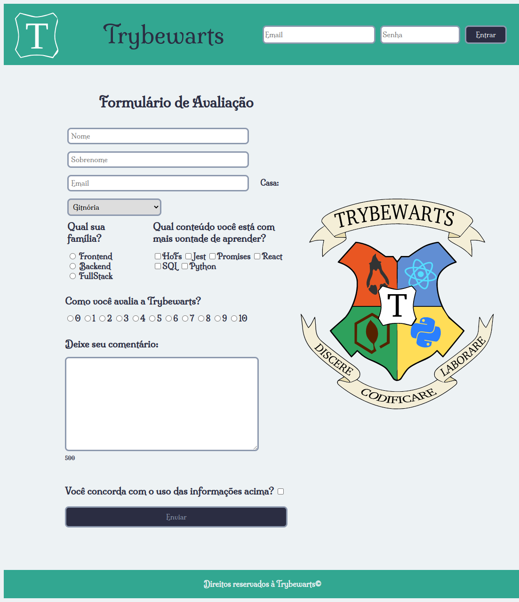

# Boas vindas ao repositório do projeto Trybewarts Wizarding School! :mage:

Projeto Bloco 6 - Modulo 1 Fundamentos do Desenvolvimento WEB - Turma 17 - Trybe.

Realizado em dupla com Thais Luza.

# Habilidades

Neste projeto, verificamos se você é capaz de:

* Criar formulários em HTML;
* Utilizar CSS Flexbox para criar layouts flexíveis;
* Criar regras CSS específicas para serem aplicadas a dispositivos móveis;
* Construir páginas que alteram o seu layout de acordo com a orientação da tela;

## Resultado

Desempenho = 100% nos requisitos totais.

## Projeto Finalizado

